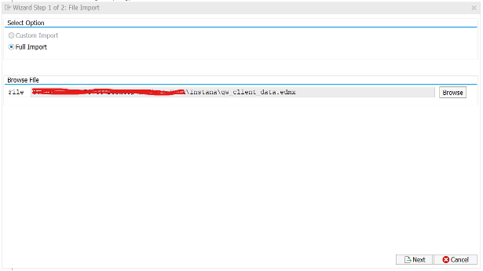
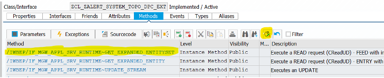

# Instana-SAP-Observability

The phase 1 of SAP Observability offering by Instana extracts metrics, exception, events and topology from SAP Solution Manager.  

The prerequisites for this phase are:
   1. SAP Solution Manager v7.2 (SolMan)
   2. The necessary SAP systems to be monitored are connected to this SolMan.
   3. SolMan is configured with System Monitoring templates for these SAP components.
   4. A system user created in SolMan for the Instana to connect to.
   5. An Ubuntu or Linux host with 4 CPU 8 GB memory for Instana Integration Proxy.

Instana then extracts the system monitoring data from SolMan by adding a OData REST endpoint. The SAP data is converted to Instana format using a component called Instana Integration Proxy.

This document describes the configuration and installation of the above components that should be done in the following order:

   1. Configure system monitoring templates in SAP Solution Manager.
   2. Install Instana OData service.
   3. Create a system user in Solution Manager for Instana to use to access the above endpoint.
   4. Install the Instana host agent on the remote Integration Proxy machine.
   5. Install the Instana Integration Proxy component.

## I.	Solution Manager Configuration

The SAP Solution Manager must be configured for system monitoring with appropriate templates created and metrics collection enabled.  Please contact your SAP Basis administrator to execute the following, if not done already.
   1. From SAP GUI, run `solman_setup` TCode.
   2. Select `Application Operations -> System Monitoring` on the left side navigation tree.
   3. Select `4. Template Maintenance` tab from the top.
   4. Switch to `Expert Mode` by clicking on the button.
   5. The following templates can be selected for the data to be displayed in Instana.  Navigate to the Metrics, Events, Alerts Hierarchy tab in the Expert mode for each component and select (or create custom template) for the desired metrics and activate them.
         - Technical System
            - SAP ABAP
            - SAP J2EE
            - SAP Web Dispatcher
         - Technical Instance
            - SAP ABAP
            - SAP ABAP Central Services
            - SAP J2EE
            - SAP J2EE Central Instance
         - Database
            - IBM DB2
            - SAP HANA DB (NEW) and (OLD)
         - Database Instance
            - SAP HANA DB 1.0 & 2.0
         - Tenant Database Instance
            - SAP DB x.x Tenant Instance
         - Host (Server)
            - The applicable operating system 

## II.   Solution Manager System User

This step will require the help of SAP Basis Administrator.

Instana Integration Proxy will require a system user to connect to the OData REST endpoint that will be created in SAP Solution Manager.  
The Basis administrator will need to create a user (using SU01) and provide the credentials to Integration Proxy installer to make the connection. 

## III.  Instana OData Service Installation

Install the OData service in the SAP Solution Manager by following these steps from the SAP GUI. 

The following files have been provided by Instana for ODATA Installations.

1. gw_client_data.edmx
2. GET_EXPANDED_ENTITYSET.txt

Log into the SAP Solution Manager through SAP GUI.

#### Step1:   Run transaction `SEGW` and create a new project


#### Step 2:  Import the provided `gw_client_data.edmx` file.





#### Step 3:   Activate OData service and save in transport request.


System automatically will create the new classes as shown below. Save it in package and Transport request.


#### Step 4:  Right click on `ZCL_ZALERT_SYSTEM_TOPO_DPC_EXT` and select `Go to ABAP Workbench` as shown below:


 - Select the `/IWBEP/IF_MGW_APPL_SRV_RUNTIME~GET_EXPANDED_ENTITYSET` to redefine it.

 - Copy and paste the new code from the provided `GET_EXPANDED_ENTITYSET.txt` file. 
 - Activate the whole class. 
 - Return to the `SEGW` transaction
 - Select the project and activate it.

#### Step 5:  Copy `ZALERT_SYSTEM_TOPOLOGY_SRV` and register OData service:


Execute `/IWFND/MAINT_SERVICE` transaction code


- Add Selected services:


#### Step 6:  Add into package and Transport request


#### Step 7:  Click on the “SAP Gateway Client”


 - Execute the below Request URL:

`/sap/opu/odata/sap/ZALERT_SYSTEM_TOPOLOGY_SRV/SYSTEMSSet?$expand=SystemToHeader/HeaderToItem/ItemToMatrics&$format=json `

## IV. Instana Integration Proxy

Instana Integration Proxy is a process that converts the data from SAP Solution Manager to Instana format.  It identifies and separates the SAP entities, correlates the topology of related entities, transforms performance metrics to Instana compatible format, and generates alerts from events.

This Instana component needs to be installed as a separate application for the closed beta.  This will eventually be folded into the Instana agent soon and will not require this additional installation step.
This component should be installed on a Linux amd64 machine, typically on a remote machine.  It will connect to the OData REST endpoint configured in the SAP Solution Manager.

The Integration Proxy is a native-cloud application and is deployed as Kubernetes pods. 
Instana may recommend using a production-ready environment like RedHat Open Shift cluster.

Also, Instana is reengineering this application to be run in a regular Instana agent and the Kubernetes requirement will no longer be necessary soon.

### Prerequisites for Instana Integration Proxy

1. Linux Ubuntu v20.04 (preferred) or Red Hat Enterprise Linux 8.4 on amd64. 
2. At least 4 CPU cores and 16 GB of memory. 
3. microk8s Kubernetes cluster (https://microk8s.io/)
4. Installed Instana Host agent on the same machine/VM. 
5. Instana agent key.

### Installation

#### Step 1: Install Instana Agent

The Instana host agent should be installed using the usual process by copying the curl command from the Agent Installation screen of the Instana UI.  This will install and start the agent.
The Integration Proxy will then be configured to connect to this agent and forward the data to the Instana backend.

#### Step 2: Install microk8s
The microk8s is packaged as a Snap, where applications are packaged with all their dependencies to run on all popular Linux distributions. 
The following two sections provide the steps for Ubunto and RHEL, respectively.

#### Ubuntu 20.04

Run the following steps to install micork8s:

```
sudo apt-get update

sudo apt install jq

sudo apt install unzip

sudo snap install microk8s --classic
```
Configure microk8s with ingress controller, etc.

```
sudo snap alias microk8s.kubectl kubectl

microk8s status --wait-ready

microk8s enable dns ingress storage metrics-server
```
Install jq the JSON processor:

```
sudo apt install jq
```

#### RedHat Enterprise Linux 8.x

Snap is available on RHEL 8 and from RHEL 7.6 onwards and are available in each distribution’s respective Extra Packages for Enterprise Linux (EPEL) repository. 

Instana recommends using RHEL 8 for this as it has been tested in 8.x.  The following installation steps from `https://snapcraft.io/install/microk8s/rhel` is applicable to this version.

Add EPEL repository for RHEL 8 using the following commands:

```
sudo dnf install https://dl.fedoraproject.org/pub/epel/epel-release-latest-8.noarch.rpm
sudo dnf upgrade
```
Adding the optional and extras repositories is also recommended:

```
sudo subscription-manager repos --enable "rhel-*-optional-rpms" --enable "rhel-*-extras-rpms"
sudo yum update    
```
Install Snap deamon:

```
sudo yum install snapd
```
Once installed, the system unit that manages the main snap communication socket needs to be enabled:

```
sudo systemctl enable --now snapd.socket
```
To enable classic snap support, create a symbolic link between /var/lib/snapd/snap and /snap:

```
sudo ln -s /var/lib/snapd/snap /snap
```
**Note:** Either log out and back in again or restart your system to ensure snap’s path are updated correctly.

Now, install microk8s using the command:

```
sudo snap install microk8s --classic
```
Configure microk8s with ingress controller, etc.

```
sudo snap alias microk8s.kubectl kubectl
microk8s status --wait-ready
microk8s enable dns ingress storage metrics-server
```
Install jq the JSON processor:

```
sudo yum install jq
```
#### Step 3:  Install and configure Instana Integration Proxy

##### Step 3.1

Extract (unzip) the Integration Proxy installation package `instana-integration-proxy-linux-amd64-1.4.0-2023-05-16-15%3A05.zip`. 

This will create a new subdirectory called `instana-integration-proxy-linux-amd64`.  

##### Step 3.2

Install the Integration Proxy by running deploy.sh from this subdirectory

```
./deploy.sh
```

During this step, the Integration Proxy will prompt for Instana agent key and ask for integrations to be included.  Answer `n` to V6/V8 and Omegamon options and `y` to SAP:


Select the defaults for storage class, Ingress class, etc. with default choices:


For the next steps, please have the REST URL string handy while completing this part. For example, the parameters are selected from the following example:

https://solman.sap.ibm.com:8272/sap/opu/odata/sap/ZALERT_SYSTEM_TOPOLOGY_SRV/SYSTEMSSet?$expand=SystemToHeader/HeaderToItem/ItemToMatrics


If you wish to connect another Solution manager, you can choose `y` for the next prompt.


The Integration Proxy now will be installed with the following final messages:


You can run the last command to see the pods getting created. Finally, the pods listing will look like the following:


##### Step 3.3
Edit the `<instana_agent_install_dir>/etc/instana/configuration.yaml` file and uncomment `com.instana.plugin.ibmapmproxy` proxy to look like the following:

```
# IBM APM-Proxy
 com.instana.plugin.ibmapmproxy:
      enabled: true
      host: '<INSERT_HOST_HERE>'
      port: 443
      datainterval: 1 # Default
      heartbeatinterval: 15 # Default
      protocol: https
```

The host name should be the same name that was specified during service deployment for ingress.
You can verify that the name is correct by using the following curl command:

```
curl -v -k https://<hostname>:443/apmproxy/data/get
```
If the host’s name is correct, an http 201 should be return by that command.

##### Step 3.4
Edit the `<instana_agent_install>/etc/instana/com.instana.agent.main.config.Agent.cfg`  file and add the following line at the end of the file:

```
http.listen=*
```
**Note:** The file above changes DO NOT require a restart of the Instana host agent.


